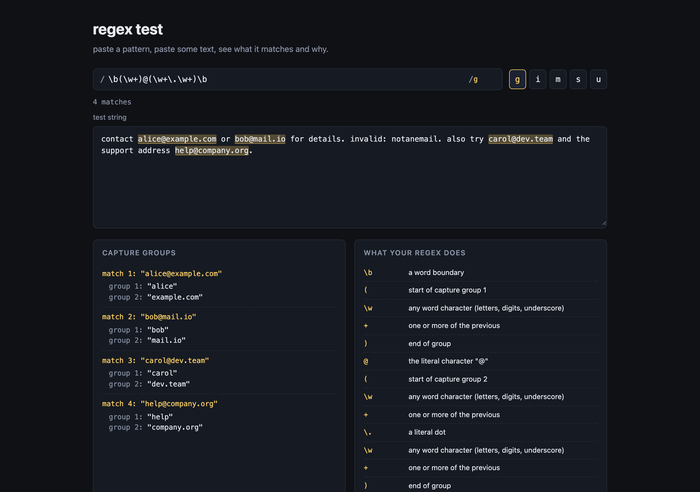

# regex-test



a tiny regex tester i built one weekend because i kept tabbing over to regex101 and i wanted something simpler that lived offline. paste a pattern, paste some text, see what it matches and why.

## what it does

- live highlighting of every match in the test string
- toggles for the usual flags: g, i, m, s, u
- match count
- capture group panel that shows what each group caught for every match
- an explainer panel that breaks the pattern down piece by piece in plain english

the explainer is the part i actually had fun with. it walks the pattern character by character, picks out tokens (literals, escapes, character classes, quantifiers, anchors, groups, alternation) and prints what each piece does. it does not handle every edge case in the spec but it covers the stuff you actually type day to day.

## running it

it is plain html, css and js. no build step.

```
git clone https://github.com/secanakbulut/regex-test.git
cd regex-test
open index.html
```

or just double click `index.html`. that is it.

## files

- `index.html` — the page
- `style.css` — dark theme, mono font for the pattern
- `app.js` — runs the regex, renders highlights, fills the panels
- `explainer.js` — the small parser that turns a pattern into english

## notes

the highlight layer is a `div` sitting under the textarea with the same font and padding, with `<mark>` tags for matches. the textarea on top stays transparent so you see the highlights through it. it is a classic trick and it works well enough.

zero-width matches (like `^` or `\b` on their own) get skipped past so the loop does not hang.

## license

PolyForm Noncommercial 1.0.0. fine for personal use, hobby stuff, learning. not for resale or commercial use without asking.
